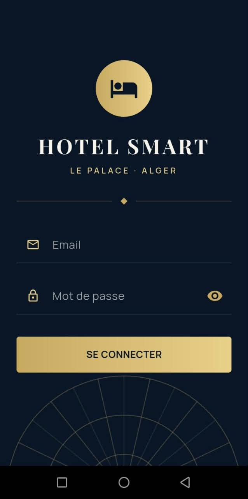
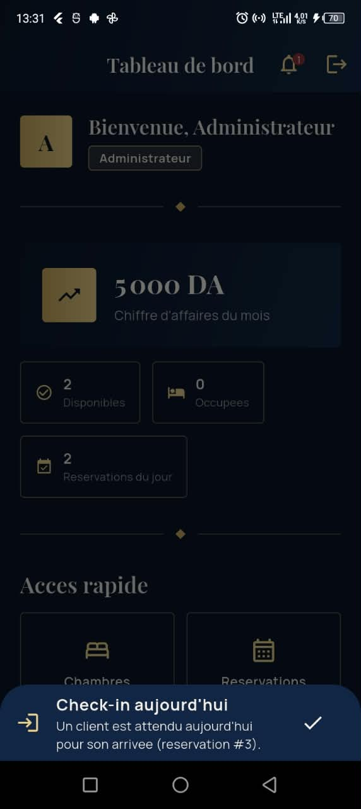
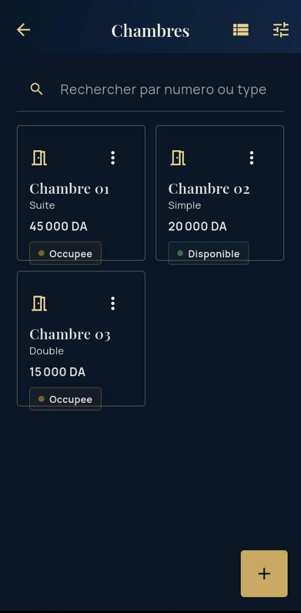
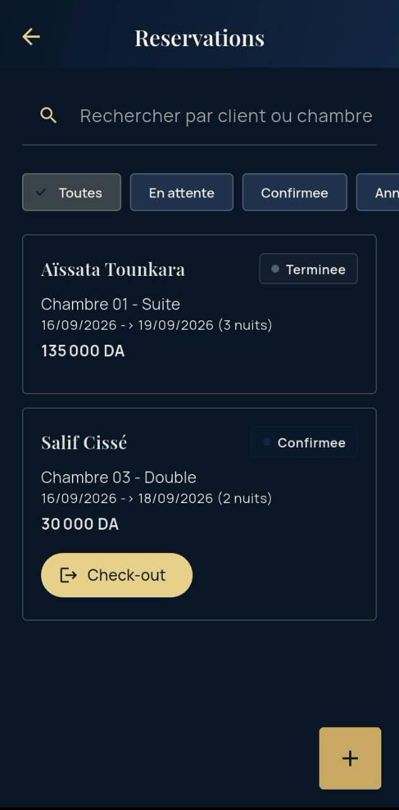
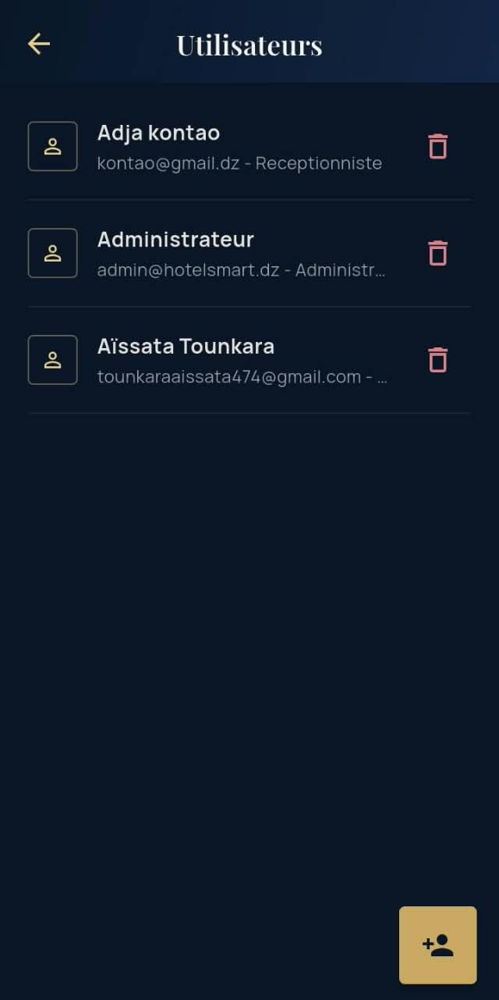

[](https://github.com/Aissata-Tounkara/hotel_smart/actions/workflows/ci.yml)

# Hotel Smart

Application mobile Flutter de gestion hoteliere pour l'hotel **Le Palace**
(4 etoiles, Alger). Trois profils : Admin, Receptionniste, Client.

## Stack technique

- Flutter / Dart (SDK stable)
- Base de donnees locale : SQLite (`sqflite`)
- API REST externe : `https://countries.dev/countries?fields=name` (nationalites) via `http`
- Gestion d'etat : `provider` (ChangeNotifier)
- Design : Material Design 3
- Autres : `path`, `shared_preferences`, `flutter_spinkit`, `intl`, `crypto`,
  `flutter_local_notifications`, `fl_chart`

## Architecture

Architecture en couches, inspiree du pattern Repository, pour separer
clairement l'UI, l'etat et l'acces aux donnees :

```
UI (screens/widgets)
   ↓ ecoute / declenche des actions
Providers (ChangeNotifier) — etat global de l'application
   ↓ appelle
Services — logique metier (authentification, statistiques, API externe, notifications)
   ↓ appelle
Repositories — une classe par table SQLite, seule couche qui parle a la base
   ↓ utilise
DatabaseHelper (Singleton) — ouverture/creation de la base SQLite
```

- **models/** : classes de donnees pures (`toMap`/`fromMap`), aucune logique metier.
- **repositories/** : CRUD SQLite brut (`UserRepository`, `RoomRepository`,
  `ClientRepository`, `ReservationRepository`, `PaymentRepository`,
  `NotificationRepository`). Aucune regle metier ici, juste des requêtes.
- **services/** : regles metier qui peuvent combiner plusieurs repositories
  (`AuthService` pour le hash + la session, `StatisticsService` pour les
  agregations du dashboard, `ApiService` pour l'appel REST des nationalites,
  `NotificationService` pour les notifications locales).
- **providers/** : etat observable par l'UI via `provider` (`AuthProvider`,
  `RoomProvider`, `ReservationProvider`, `ClientProvider`, `PaymentProvider`,
  `SettingsProvider`).
- **routes/** : navigation nommee centralisee (`app_routes.dart`).
- **utils/** : theme, validateurs, constantes, helpers partages.

### Decisions de conception

- **`Utilisateur` != `Client`** : `Utilisateur` est un compte de connexion
  (email, mot de passe hache, role). `Client` est la fiche d'un client de
  l'hotel (nom, telephone, nationalite). Un `Utilisateur` peut etre lie a un
  `Client` via `clientId` (nullable), mais cette liaison est toujours
  manuelle : c'est l'Admin qui cree un compte Client depuis l'ecran de
  gestion des utilisateurs, en le rattachant a une fiche client deja creee
  par le receptionniste.
- **`Statistique` n'est pas une table** : classe de calcul (`services/statistics_service.dart`)
  qui agrege a la volee les donnees de `reservations`, `payments` et `rooms`.
- **`notifications`** est bien une table SQLite : elle stocke les alertes
  locales de check-in/check-out generees pour le personnel.
- **Schema SQLite** : 5 tables + notifications -> `users`, `rooms`, `clients`,
  `reservations`, `payments`, `notifications`, avec cles etrangeres
  (`reservations.client_id`, `reservations.room_id`,
  `payments.reservation_id`, `notifications.reservation_id`,
  `users.client_id`).
- **Compte Admin par defaut** : a la creation de la base, un compte
  `admin@hotelsmart.dz` (mot de passe hache en SHA-256) est insere
  automatiquement pour ne jamais bloquer l'acces a l'application.
- **API des nationalites** : le cahier des charges citait
  `restcountries.com/v3.1`, mise hors service depuis (redirige vers une v5
  qui exige une cle API - inadapte a une app mobile, une cle embarquee
  etant visible par decompilation triviale de l'APK). Remplacee par
  `countries.dev`, gratuite et sans authentification. Une liste de secours
  locale (30 nationalites courantes) prend automatiquement le relai si
  l'API est indisponible, pour ne jamais bloquer le formulaire client.
- **Design premium Material 3** : identite de marque hoteliere bleu nuit /
  or (`utils/app_theme.dart`, classe `AppTheme`) - bleu nuit profond
  `#0A1628` et surface `#122544`, or `#C9A961` et or lumineux `#E8CF8A`,
  ivoire `#F7F3EA`, encre `#16223A`, bordeaux `#8C2F39` (erreurs).
  Typographie Playfair Display (titres) + Manrope (texte courant),
  embarquee localement (`assets/fonts/`). Composants signature reutilisables
  dans `widgets/` : `AppTextField` (champs soulignes), `OrnamentalDivider`
  (separateur a losange dore), `ArtDecoFan` (motif reserve a l'ecran de
  connexion), `PremiumAppBar`, `GradientButton`, `HeroStatCard`/`MiniStat`,
  `PremiumListTile`. Le theme sombre reprend l'habillage bleu nuit du login
  plutot qu'un mode sombre Material generique. Toutes les couleurs de
  statut (`utils/ui_helpers.dart`) sont derivees de cette meme palette,
  choisies pour un contraste texte suffisant (WCAG AA) sur fond clair et
  sombre.

## Documentation

- [`docs/diagramme_cas_utilisation.puml`](docs/diagramme_cas_utilisation.puml) — diagramme de cas d'utilisation (PlantUML).
- [`docs/diagramme_classes.puml`](docs/diagramme_classes.puml) — diagramme de classes (PlantUML).
- [`docs/wireframes.md`](docs/wireframes.md) — wireframes des ecrans principaux.
- [`docs/documentation_technique.md`](docs/documentation_technique.md) — documentation technique (Jour 3).
- [`docs/manuel_utilisateur.md`](docs/manuel_utilisateur.md) — manuel utilisateur (Jour 3).
- [`docs/demo.md`](docs/demo.md) — support de demonstration (Jour 3).

## Captures d'écran

| Connexion | Tableau de bord |
| --- | --- |
|  |  |

| Liste des chambres | Liste des réservations |
| --- | --- |
|  |  |



## Internationalisation

L'interface est disponible en français et en anglais. La langue se choisit dans
les paramètres et le choix est conservé.

## Accessibilité

Les boutons d'icône ont des infobulles, et les éléments de listes et graphiques
fournissent des résumés sémantiques aux lecteurs d'écran.

## Performance

- Les composants réutilisables et une grande partie de l'interface utilisent
  des constructeurs `const` lorsque leurs paramètres sont constants.
- Les longues listes de données utilisent `ListView.builder` ou
  `ListView.separated` pour construire les éléments au besoin.
- Les écrans de chambres, clients, réservations, paiements et tableau de bord
  utilisent `context.select` pour écouter les champs pertinents des providers
  et limiter les reconstructions.
- Les graphiques ne recalculent leurs widgets que lorsque les données de
  statistiques sélectionnées changent.

## Journal des modifications

Voir [`CHANGELOG.md`](CHANGELOG.md) pour l'historique des versions.

## Lancer le projet

```bash
flutter pub get
flutter run
```

Au premier lancement, la base SQLite est creee automatiquement avec un
compte Admin de démonstration par défaut, à changer en production :

- email : `admin@hotelsmart.dz`
- mot de passe : `Admin@123`

## Télécharger l'APK

Les APK publiés sont disponibles dans les [Releases GitHub](https://github.com/Aissata-Tounkara/hotel_smart/releases).

## Tests

Le dépôt contient 21 tests unitaires, 5 tests de widgets et 2 tests
d'intégration. `flutter test` est exécuté par la CI. La commande
`flutter test integration_test` nécessite un émulateur ou un appareil et se
lance en local.

```bash
flutter test
flutter test integration_test
```
