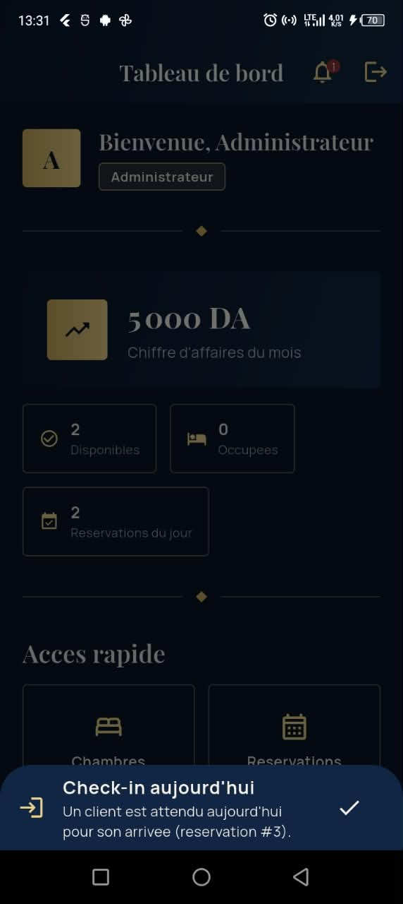
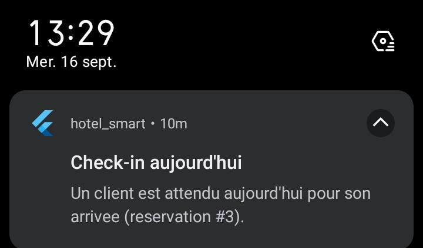
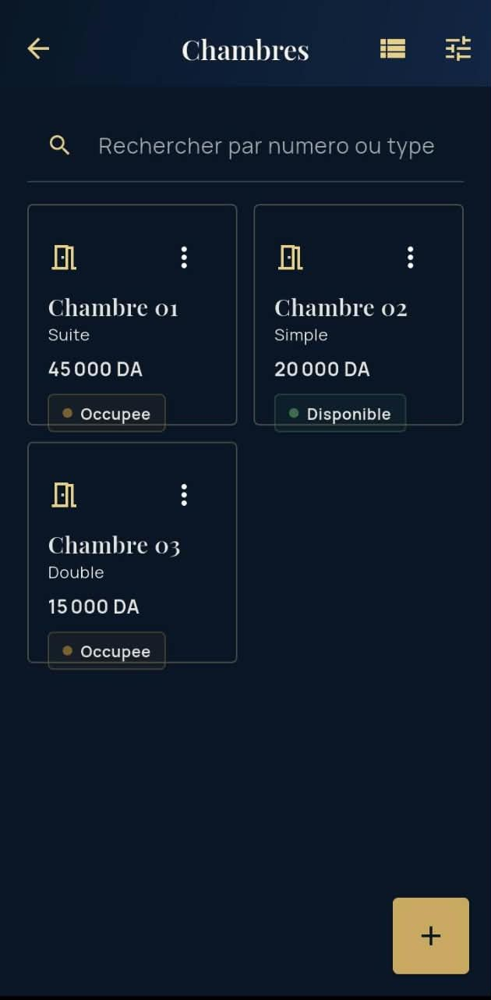
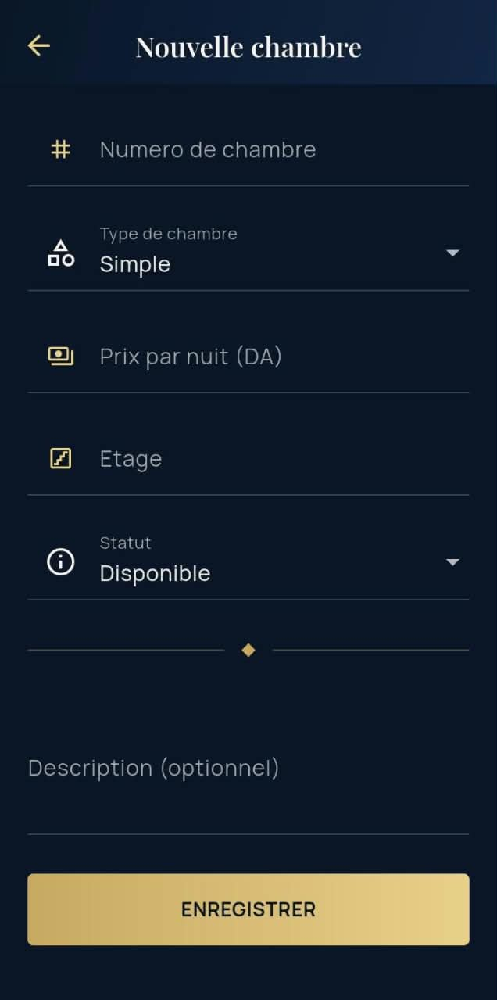
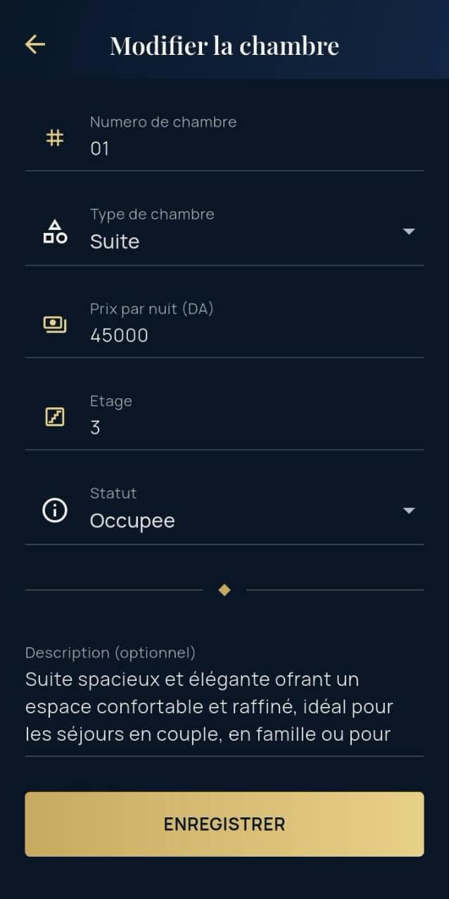
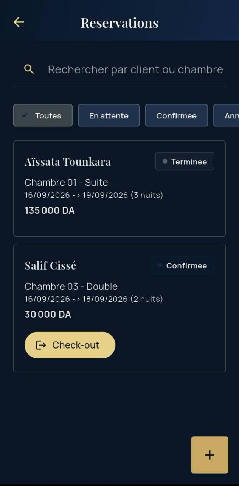
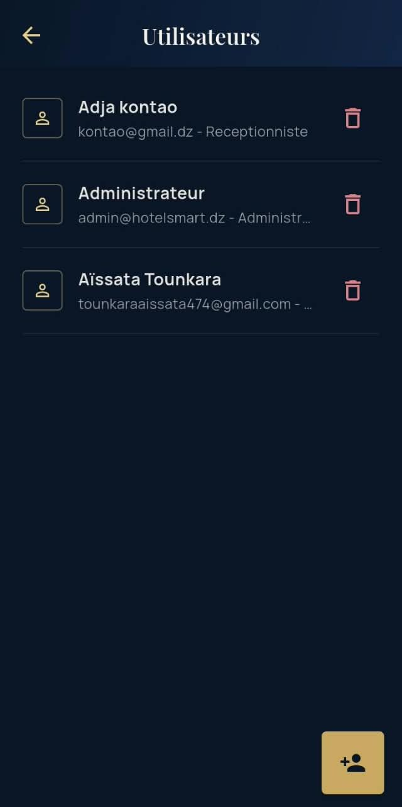
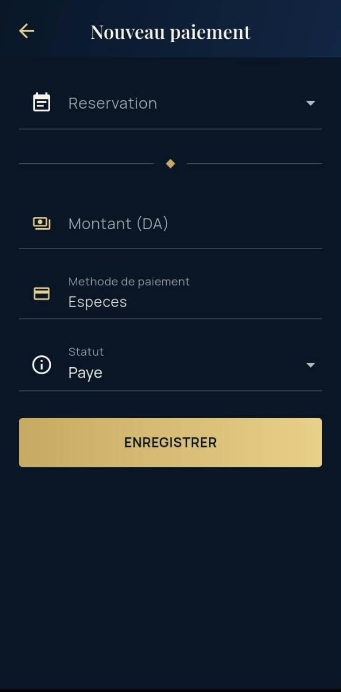
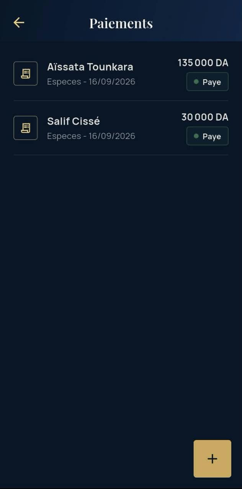
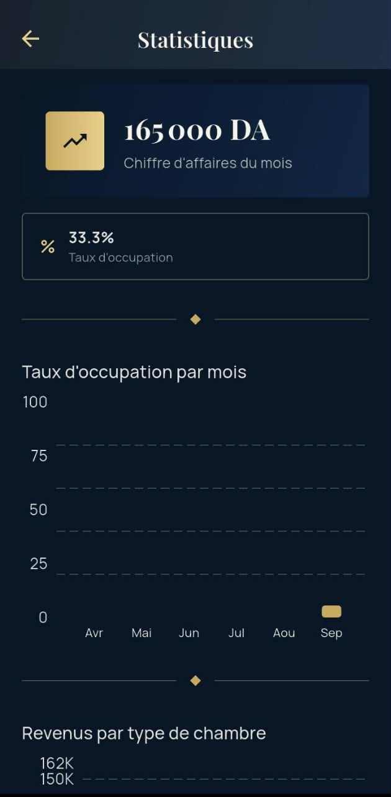

# Manuel utilisateur - Hotel Smart

## 1. Connexion

Au lancement de l'application, entrez votre email et votre mot de passe
puis appuyez sur **Se connecter**.

Compte Admin fourni par defaut (premier lancement) :
- Email : `admin@hotelsmart.dz`
- Mot de passe : `Admin@123`

Un compte Receptionniste ou Client doit vous etre cree par un Admin
(ecran **Utilisateurs**).

## 2. Tableau de bord

Apres connexion, le tableau de bord affiche :
- Un message de bienvenue avec votre role.
- (Admin/Receptionniste) Des cartes de statistiques : chambres
  disponibles/occupees, reservations du jour, chiffre d'affaires du mois.
- Une grille d'acces rapide vers les fonctionnalites disponibles pour
  votre role.
- (Admin/Receptionniste) Une cloche de notifications signalant les
  check-in/check-out prevus aujourd'hui.

*Un badge rouge apparait sur la cloche des qu'une reservation arrive ou
part aujourd'hui. Appuyez dessus pour afficher la liste des alertes non
lues et les marquer comme lues.*

*En plus de la cloche dans l'application, une notification systeme
Android s'affiche automatiquement pour chaque check-in ou check-out du
jour, meme si l'application est en arriere-plan.*

## 3. Gestion des chambres (Admin, Receptionniste)

- **Voir la liste** : bascule entre vue Carte et vue Liste via l'icone en
  haut a droite.
- **Rechercher** : tapez un numero ou un type de chambre dans la barre de
  recherche (mise a jour en temps reel).
- **Filtrer** : bouton entonnoir -> choisissez un type, un statut et/ou
  une plage de prix, puis **Appliquer**.
- **Ajouter** : bouton **+** en bas a droite.
- **Modifier/Supprimer** : appuyez sur une chambre (vue liste : menu ⋮ ;
  vue carte : menu en haut a droite de la carte).

*Chaque carte affiche le numero, le type, le prix par nuit et le statut
courant de la chambre (Disponible, Occupee ou Maintenance).*

*Numero, type, prix par nuit, etage et statut initial sont obligatoires ;
la description est optionnelle.*

*Le meme formulaire, pre-rempli, permet de corriger le prix, changer le
statut (par exemple repasser une chambre en Maintenance) ou completer la
description.*

## 4. Reservations (Admin, Receptionniste)

- **Creer une reservation** : bouton **+**, choisissez un client, une date
  d'arrivee puis de depart. La liste des chambres disponibles pour ces
  dates s'affiche automatiquement (les chambres en conflit de dates ou en
  maintenance sont exclues). Selectionnez une chambre : le montant total
  se calcule automatiquement (prix par nuit x duree du sejour).
- **Filtrer par statut** : chips en haut de la liste (Toutes, En attente,
  Confirmee, Annulee, Terminee).
- **Check-in** : sur une reservation *En attente*, bouton **Check-in** ->
  confirme la reservation et passe la chambre en "Occupee".
- **Check-out** : sur une reservation *Confirmee*, bouton **Check-out** ->
  termine la reservation et remet la chambre "Disponible".
- **Annuler** : disponible sur une reservation *En attente*.

*Le filtre "Toutes" montre chaque reservation avec son statut colore
(En attente, Confirmee, Terminee, Annulee). Le bouton d'action affiche
(Check-in ou Check-out) depend du statut courant de la reservation.*

## 5. Clients (Admin, Receptionniste)

- **Ajouter/Modifier** un client : renseignez nom, prenom, telephone,
  email, nationalite (liste chargee depuis internet ; si vous etes hors
  connexion ou que le service est indisponible, une liste de secours
  locale s'affiche automatiquement avec un message discret et un bouton
  **Reessayer** - le formulaire n'est jamais bloque) et CIN/passeport
  (optionnel).
- **Rechercher** : par nom, telephone ou email.

## 6. Utilisateurs (Admin uniquement)

- **Creer un compte** : nom, email, mot de passe, role (Admin,
  Receptionniste ou Client).
- Si le role choisi est **Client**, vous devez lier le compte a une fiche
  client deja existante (creee au prealable par un receptionniste dans
  l'ecran Clients). C'est cette liaison qui permet a un client de se
  connecter et de voir *ses* reservations.
- **Modifier/Supprimer** un compte depuis la liste.

*Chaque ligne affiche le nom, l'email et le role du compte. L'icone
corbeille permet de le supprimer directement depuis la liste.*

## 7. Paiements (Admin, Receptionniste)

- **Enregistrer un paiement** : bouton **+**, selectionnez la
  reservation concernee (le montant se pre-remplit avec le montant total
  de la reservation), choisissez la methode et le statut.
- **Changer le statut** : appuyez sur un paiement dans la liste pour
  choisir Paye / En attente / Rembourse.

*Selectionnez la reservation, ajustez le montant si besoin, choisissez
la methode (Especes, Carte...) et le statut du paiement.*

*Chaque paiement affiche le client, la methode, la date et le montant,
avec un badge de statut (Paye, En attente, Rembourse).*

## 8. Statistiques (Admin)

- Taux d'occupation moyen et chiffre d'affaires du mois en cartes de
  resume.
- Graphique en barres : taux d'occupation des 6 derniers mois.
- Graphique en barres : revenus cumules par type de chambre (Simple,
  Double, Suite).

*Vue d'ensemble : chiffre d'affaires du mois, taux d'occupation moyen,
puis les deux graphiques (occupation par mois, revenus par type de
chambre).*

## 9. Mes reservations (Client)

Affiche uniquement vos propres reservations (chambre, dates, montant,
statut). Si votre compte n'est pas encore lie a une fiche client,
contactez la reception.

## 10. Profil et parametres

- **Mon profil** : modifiez votre nom, votre email et votre mot de passe
  (confirmation requise), ou deconnectez-vous.
- **Parametres** (icone engrenage sur l'ecran Profil) : choisissez le
  theme (Clair / Sombre / Systeme) et la langue (Francais / العربية).
  Le changement de langue applique le sens de lecture (RTL en arabe) et
  traduit les ecrans principaux (connexion, dashboard, parametres,
  profil).

## 11. Questions frequentes

**J'ai oublie mon mot de passe.** Contactez un Admin : il peut modifier
votre compte depuis l'ecran Utilisateurs.

**Je ne peux pas supprimer une chambre/un client.** Verifiez qu'aucune
reservation active n'est bloquante ; en cas de doute, contactez un Admin.

**Un message "liste hors-ligne" s'affiche sur le champ nationalite.**
C'est normal si vous n'avez pas de connexion internet ou que le service
est momentanement indisponible : une liste de secours locale (30
nationalites courantes) est utilisee automatiquement pour ne jamais
bloquer la creation d'un client. Appuyez sur **Reessayer** des que votre
connexion est retablie pour recharger la liste complete.
